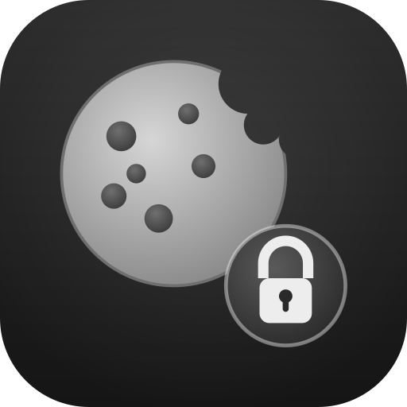

<p align="center"></p>

# DBSC Bundle

**Device Bound Session Credentials (DBSC)** for Symfony. It protects authenticated sessions
from cookie theft by binding them to a hardware-backed private key (TPM) held by the user's
browser.

> Status: **early work in progress**. The [DBSC specification](https://w3c.github.io/webappsec-dbsc/)
> is still a draft shipping behind a Chrome origin trial, so header names and payloads may change.

## What it does

DBSC complements your existing authentication (passwords, WebAuthn, SSO). It does not change
how users log in: it hardens the credential that follows. After login the browser generates a
device-bound key pair and proves possession of it periodically, so a stolen cookie replayed
from another machine stops working. The browser drives all the cryptography; the server side is
one response header plus two endpoints, all provided by this bundle. Browsers without DBSC
support degrade gracefully.

## Installation

```bash
composer require spomky-labs/dbsc-bundle
```

## Getting started

In **additive mode** a short, device-bound cookie is issued alongside your existing session,
which stays authoritative. You opt in at login and allow the two endpoints; the firewall is
unchanged.

When you are ready, DBSC can take over the long-lived credential (the remember-me role) with a
single firewall key (`device_bound_session: true`).

See [Adoption modes](doc/modes.md) for both, including the opt-in badge and the access control
to define.

## Documentation

Full documentation lives in [`doc/`](doc/index.md):

- [Concepts and security model](doc/concepts.md)
- [Installation](doc/installation.md)
- [Configuration reference](doc/configuration.md)
- [Adoption modes](doc/modes.md)
- [Migrating from remember-me](doc/remember-me-migration.md)
- [Protocol and endpoints](doc/protocol.md)
- [Production storage](doc/storage.md)
- [Extending the bundle](doc/extending.md)

## License

MIT. See [LICENSE](LICENSE).
